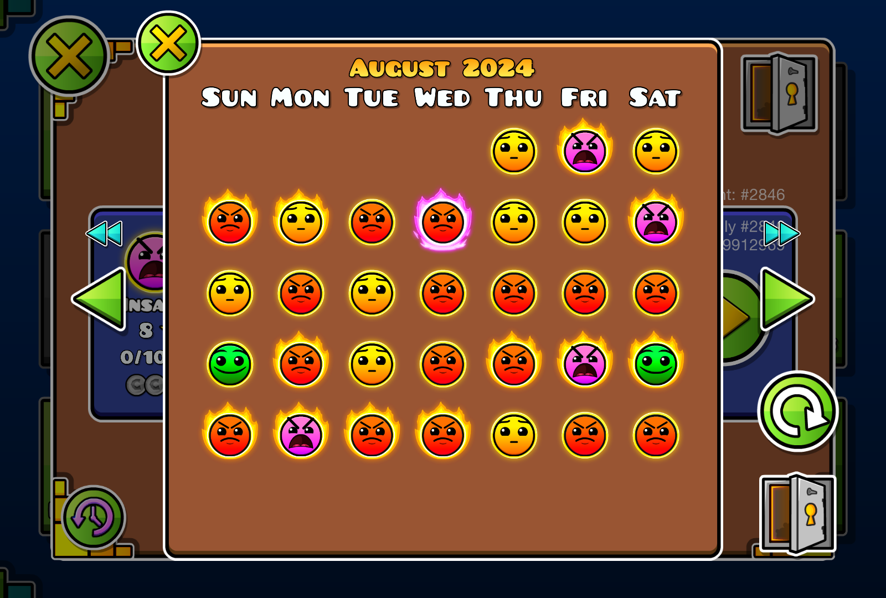
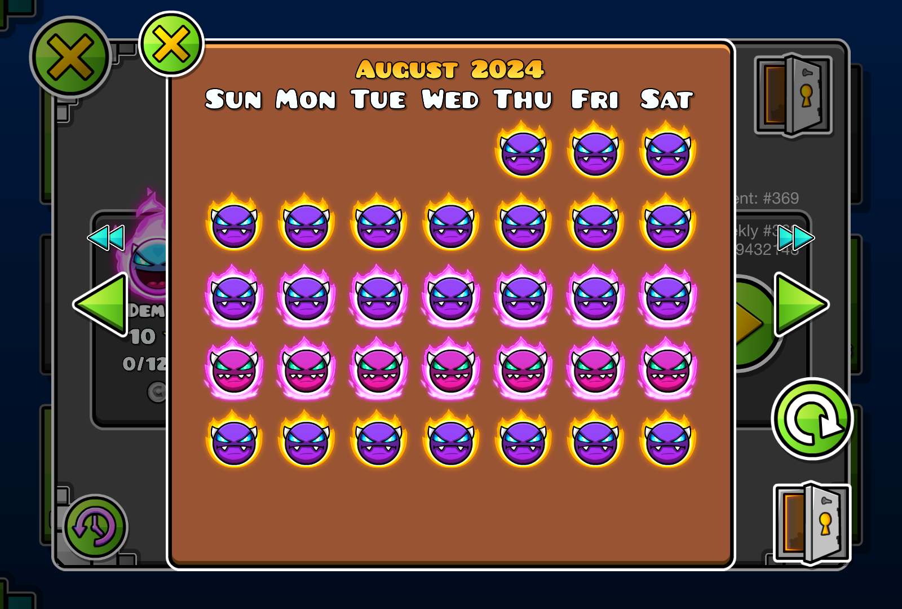

# Better Safe
A mod that expands The Safe with a calendar.

# Features
- Calendars for daily, weekly and event levels, showing what was featured on each day
- daily, weekly and event level previews, showing basic information about the level on click
- Navigation buttons to go to the previous or next month
- A label showing the current month and year, which can be used to switch to a specific month

# Credits
- [Opianisal](https://gdbrowser.com/u/25221350) - Idea for the mod
- [Every Rated Level Spreadsheet](https://docs.google.com/spreadsheets/d/1BBx9X8IYBtr7dA5cWu_smM2XBkLZzCXy7TjeEWRgag0) - Help with daily/weekly dates
- [hiimjustin000](https://gdbrowser.com/u/7466002) - Creator of the mod

# Gallery
\

# License
This mod is licensed under the [MIT License](./LICENSE).